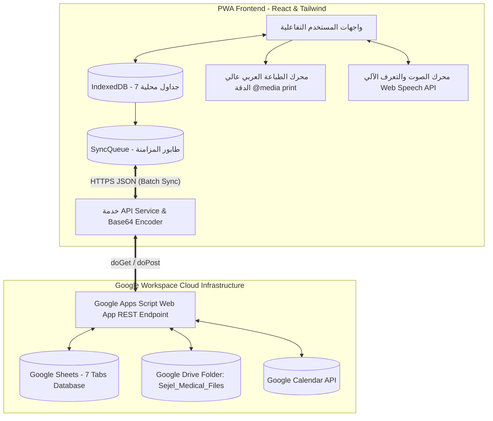

# وثيقة المواصفات الفنية والهندسية لنظام "سِجِل" (Sejel Technical Specification)

> **الإصدار:** 1.1.0  
> **النوع:** منصة رعاية صحية شخصية وعائلية تقدمية (PWA Health & Medical Record)  
> **البنية:** Offline-First Architecture with Google Workspace Backend (Sheets, Drive, Calendar, Apps Script)  
> **الطباعة والتصدير:** Native Arabic UTF-8 Browser Printing (`@media print` + Cairo/Tajawal Typography)

---

## 1. المعمارية الهندسية للنظام (System Architecture)



---

## 2. مصفوفة الجداول وقواعد البيانات (Database Schema Definition)

يتطابق التخزين المحلي في **IndexedDB** مع التبويبات الـ 7 في **Google Sheets** بدقة تامة:

### 1. جدول المرضى (`Patients`)
- `PatientID` (PK, String): المعرف الفريد للمريض (مثال: `P_01`).
- `Name` (String): الاسم الكامل.
- `BirthDate` (Date/String): تاريخ الميلاد (`YYYY-MM-DD`).
- `Gender` (Enum): `Male` / `Female`.
- `BloodType` (Enum): `A+`, `A-`, `B+`, `B-`, `AB+`, `AB-`, `O+`, `O-`.
- `Height` (Number): الطول بالسنتيمتر.
- `Weight` (Number): الوزن بالكيلوجرام.
- `Allergies` (String): الحساسيات والتحذيرات الحرجة.
- `ChronicDiseases` (String): الأمراض المزمنة.
- `Surgeries` (String): العمليات الجراحية السابقة.
- `EmergencyContactName` (String): اسم جهة اتصال الطوارئ.
- `EmergencyContactPhone` (String): رقم هاتف الطوارئ.
- `GuardianEmail` (String): البريد الإلكتروني لولي الأمر.
- `PIN` (String): رمز الحماية المحلي المكون من 4 أرقام.
- `CreatedAt` / `UpdatedAt` (ISO DateTime).

### 2. جدول الزيارات الطبية (`Visits`)
- `VisitID` (PK, String): معرف الزيارة (مثال: `V_01`).
- `PatientID` (FK, String): معرف المريض التابع له.
- `Date` (Date/String): تاريخ الاستشارة الطبية.
- `DoctorName` (String): اسم الطبيب المعالج.
- `Specialty` (String): التخصص الطبي.
- `Clinic` (String): اسم المستشفى أو العيادة.
- `Diagnosis` (String): التشخيص الطبي للحالة.
- `Notes` (String): توصيات الطبيب وإرشادات العلاج.
- `NextAppointmentDate` (Date/String): موعد المراجعة القادم.
- `Attachments` (JSON String / Array): مصفوفة معرفات الملفات المرتبطة في Drive.

### 3. جدول الأدوية (`Medications`)
- `MedicationID` (PK, String): معرف الدواء.
- `PatientID` (FK, String): معرف المريض.
- `Name` (String): اسم الدواء التجاري/العلمي.
- `Dosage` (String): الجرعة (مثال: 5mg, حبة واحدة).
- `Frequency` (String): تكرار الجرعات.
- `StartDate` / `EndDate` (Date/String): فترة الاستخدام.
- `Instructions` (String): تعليمات التناول (قبل/بعد الأكل).
- `ReminderEnabled` (Boolean): تفعيل التنبيهات.
- `LastTakenDate` (ISO DateTime): تاريخ ووقت آخر جرعة تم تسجيل تناولها.

### 4. جدول القياسات الحيوية (`Vitals`)
- `VitalID` (PK, String): معرف القياس.
- `PatientID` (FK, String): معرف المريض.
- `Date` (ISO DateTime): وقت وتاريخ القياس.
- `Type` (Enum): `BloodPressure`, `Sugar`, `Pulse`, `Temperature`, `Weight`, `Oxygen`.
- `Value` (String): القيمة المسجلة (مثال: `120/80`, `95`).
- `Unit` (String): وحدة القياس (`mmHg`, `mg/dL`, `bpm`, `°C`, `kg`, `%`).
- `Notes` (String): ملاحظات السياق (صائم، بعد مجهود، في الراحة).

### 5. جدول مفكرة الأعراض والتسجيل الصوتي (`Symptoms`)
- `SymptomID` (PK, String): معرف العرض المرضي.
- `PatientID` (FK, String): معرف المريض.
- `Date` (ISO DateTime): توقيت ظهور العرض.
- `Description` (String): الوصف المكتوب أو التفريغ الصوتي المباشر.
- `Severity` (Number): مقياس شدة الألم من 1 إلى 10.
- `AudioFileURL` (String): رابط الملف الصوتي المخزن على Google Drive.
- `Duration` (String): مدة استمرار العرض.
- `Notes` (String): ملاحظات المحفزات.

### 6. جدول المواعيد والتقويم (`Appointments`)
- `AppointmentID` (PK, String): معرف الموعد.
- `PatientID` (FK, String): معرف المريض.
- `Title` (String): عنوان الموعد أو الغرض منه.
- `DoctorName` (String): اسم الطبيب.
- `Date` / `Time` (String): تاريخ ووقت الحضور.
- `Location` (String): مكان العيادة أو المستشفى.
- `Notes` (String): تعليمات التحضير.
- `CalendarEventID` (String): معرف الحدث في Google Calendar.

### 7. جدول المستندات والروشتات السحابية (`Files`)
- `FileID` (PK, String): معرف الملف الفريد.
- `PatientID` (FK, String): معرف المريض.
- `FileName` (String): اسم الملف الأصلي.
- `Category` (Enum): `Prescription`, `Lab`, `Radiology`, `Report`, `Vaccination`, `Other`.
- `FileType` (Enum): `PDF`, `Image`, `Audio`, `Document`.
- `DriveURL` (String): رابط المعاينة والتحميل المباشر من Google Drive.
- `VisitID` (FK, String): معرف الزيارة المرتبطة (إن وجد).
- `UploadedAt` (ISO DateTime): تاريخ وتوقيت الرفع.

---

## 3. محرك الطباعة العربي المخصص (Native Arabic Print Engine)

تعتمد المنصة على معيار الطباعة الأصلي للمتصفح (`window.print()`) بدلاً من مكتبات PDF الخارجية لتفادي أي مشاكل في تشويه الحروف العربية أو الخطوط:
1. **تنسيقات `@media print` المخصصة:**
   - عزل وإخفاء عناصر التصفح والتحكم والأزرار.
   - ضبط حجم الصفحة القياسي `A4` مع هوامش دقيقة واتجاه RTL إلزامي.
   - دعم التباين العالي وإظهار ترويسة بطاقة الطوارئ باللون الأحمر والحدود الواضحة.
2. **الخطوط:** استخدام خطوط Google الطبية **Cairo** و **Tajawal** المعرفة محلياً وسحابياً لضمان وضوح النصوص.

---

## 4. محرك رفع الوثائق إلى Google Drive (Base64 Upload Engine)

1. يتم تحويل الملف في المتصفح إلى سلسلة **Base64** عبر `FileReader`.
2. يتم إرسال طلب `POST` كـ `text/plain` يحتوي على:
   ```json
   {
     "action": "uploadFile",
     "fileName": "تحليل_دم_شامل.pdf",
     "fileData": "data:application/pdf;base64,...",
     "mimeType": "application/pdf",
     "patientId": "P_01",
     "category": "Lab",
     "visitId": "V_01",
     "fileType": "PDF"
   }
   ```
3. يقوم كود Google Apps Script بفك تشفير الـ Base64 وحفظ الملف داخل مجلد `Sejel_Medical_Files` على Google Drive، وتعيين الصلاحيات وإعادة رابط العرض `DriveURL` ورابط التنزيل `DownloadURL`.
4. يتم تحديث السجل في IndexedDB وفي جدول `Files` السحابي وتحديث حقل `Attachments` في جدول `Visits`.
