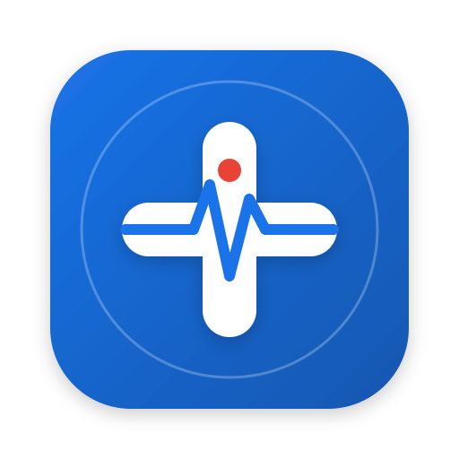

# سِجِل (Sejel) - السجل الصحي الشخصي والعائلي الذكي 🩺✨

تطبيق ويب تقدمي (PWA) متكامل لإدارة ومراقبة الصحة الشخصية والملف الطبي للأفراد والعائلة. يعمل بالكامل دون اتصال بالإنترنت (**Offline-First**) مع دعم الطباعة والتصدير العربي عالي الدقة، والمزامنة السحابية التلقائية عبر **Google Sheets** كقاعدة بيانات، و **Google Drive** لتخزين المستندات والروشتات، و **Google Calendar** للمواعيد والتذكيرات.



---

## 🎯 المميزات الرئيسية (Key Highlights)

- 🔒 **العمل دون إنترنت (Offline-First):** تخزين محلي كامل في **IndexedDB** عبر 7 جداول متطابقة مع سحابة Google مع طابور مزامنة ذكي (`syncQueue`).
- 📄 **طباعة عربية نقية 100% (Native Arabic UTF-8 Printing):** اعتماد نظام `@media print` المخصص للطباعة من المتصفح مباشرة (`window.print()`) وبخطوط **Cairo/Tajawal** لضمان عدم حدوث أي تشويش في الحروف أو الرموز عند طباعة الروشتات، بطاقة الطوارئ، أو التقارير الطبية.
- 📁 **تخزين الوثائق في Google Drive:** رفع الوثائـق والتحاليل والروشتات بتقنية Base64 مباشرة إلى مجلد سحابي مخصص (`Sejel_Medical_Files`) في Google Drive مع تخزين روابط المعاينة والتنزيل.
- 🚨 **بطاقة طوارئ تفاعلية (SOS Card):** واجهة عالية التباين تعرض فصيلة الدم والحساسيات الحرجة وزر اتصال مباشر بجهة الطوارئ ورمز QR للمسعفين.
- 🎙️ **تسجيل الأعراض صوتياً (Voice AI):** تحويل فوري من الصوت إلى نص (Web Speech API) مع حفظ الصوت الأصلي ومقياس لشدة الألم (1 إلى 10).
- 💊 **متابعة الأدوية والالتزام اليومي:** جدول الجرعات ومتابعة الالتزام العلاجي وحساب نسبة الالتزام `Adherence Rate`.
- 📊 **المؤشرات والقياسات الحيوية:** متابعة الضغط والسكر والنبض والوزن مع رسوم بيانية وتكامل Google Fit.
- 👨‍👩‍👧‍👦 **وضع العائلة (Family Mode):** إدارة حسابات متعددة لأفراد الأسرة تحت إشراف ولي أمر واحد.

---

## 🛠️ البنية التقنية وهيكلية الجداول (Tech Stack & Database Schema)

| التبويب في Google Sheets | الوصف | الحقول الأساسية |
| :--- | :--- | :--- |
| **Patients** | بيانات المرضى وأفراد العائلة | `PatientID`, `Name`, `BirthDate`, `Gender`, `BloodType`, `Height`, `Weight`, `Allergies`, `ChronicDiseases`, `Surgeries`, `EmergencyContactName`, `EmergencyContactPhone`, `GuardianEmail`, `PIN`, `CreatedAt`, `UpdatedAt` |
| **Visits** | زيارات واستشارات الأطباء | `VisitID`, `PatientID`, `Date`, `DoctorName`, `Specialty`, `Clinic`, `Diagnosis`, `Notes`, `NextAppointmentDate`, `Attachments` |
| **Medications** | الأدوية وجدول الجرعات | `MedicationID`, `PatientID`, `Name`, `Dosage`, `Frequency`, `StartDate`, `EndDate`, `Instructions`, `ReminderEnabled`, `LastTakenDate` |
| **Vitals** | القياسات الحيوية | `VitalID`, `PatientID`, `Date`, `Type`, `Value`, `Unit`, `Notes` |
| **Symptoms** | سجل الأعراض والتسجيل الصوتي | `SymptomID`, `PatientID`, `Date`, `Description`, `Severity`, `AudioFileURL`, `Duration`, `Notes` |
| **Appointments** | المواعيد والتقويم | `AppointmentID`, `PatientID`, `Title`, `DoctorName`, `Date`, `Time`, `Location`, `Notes`, `CalendarEventID` |
| **Files** | المستندات والروشتات في Drive | `FileID`, `PatientID`, `FileName`, `Category`, `FileType`, `DriveURL`, `VisitID`, `UploadedAt` |

---

## 🚀 دليل الربط والإعداد خطوة بخطوة للمستخدم النهائي

### الخطوة 1: إعداد قاعدة البيانات في Google Sheets
1. توجه إلى [Google Sheets](https://sheets.new) وأنشئ جدولاً جديداً باسم **`Sejel_Health_Database`**.
2. من القائمة العلوية للجدول، اضغط على **Extensions (الإضافات)** ثم اختر **Apps Script**.
3. احذف أي كود موجود في نافذة المحرر، ثم أنشئ ملفين:
   - ملف باسم `Setup.gs`: وانسخ بداخله محتوى الملف [`backend/Setup.gs`](backend/Setup.gs).
   - ملف باسم `Code.gs`: وانسخ بداخله محتوى الملف [`backend/Code.gs`](backend/Code.gs).
   - من إعدادات المشروع (أيقونة الترس ⚙️) اختر **"Show appsscript.json manifest"** واستبدل محتواه بملف [`backend/appsscript.json`](backend/appsscript.json).
4. من شريط الأدوات العلوي، اختر دالة **`setupDatabase`** واضغط على زر **Run (تشغيل)**.
   - ستظهر نافذة تطلب منح الصلاحيات للوصول إلى Google Drive وجداول البيانات وتقويم Google، اضغط **Review Permissions** ثم **Advanced** ثم **Allow**.
   - ستنشئ الدالة آلياً التبويبات الـ 7 وتنسق ألوانها، وتنشئ مجلداً على Google Drive باسم `Sejel_Medical_Files`، وتدرج بيانات أولية تجريبية.

---

### الخطوة 2: نشر الـ Web App واستخراج رابط الربط
1. في صفحة Apps Script، اضغط على الزر الأزرق أعلى اليمين: **Deploy (نشر)** -> **New deployment (نشر جديد)**.
2. اضغط على أيقونة الترس ⚙️ بجانب **Select type** واختر **Web app**.
3. اضبط الإعدادات كالتالي بدقة:
   - **Description:** `Sejel Web App API v1.0`
   - **Execute as (التنفيذ كـ):** `Me (حسابك الشخصي على Google)`
   - **Who has access (من يمكنه الوصول):** `Anyone (أي شخص)` *(ملاحظة هامة: هذا يسمح للتطبيق بالتواصل مع الـ API بأمان)*.
4. اضغط على **Deploy** ثم انسخ رابط الويب المعروض **(Web App URL)** المنتهي بـ `/exec`.
   - مثال للرابط: `https://script.google.com/macros/s/AKfycb.../exec`

---

### الخطوة 3: ربط التطبيق بالرابط السحابي
1. افتح تطبيق **سِجِل** على جهازك (أو من خادم التطوير / رابط الاستضافة).
2. افتح تبويب **الإعدادات (Settings)** من الشريط الجانبي أو القائمة السفلية.
3. في خانة **رابط تطبيق الويب (Web App URL)**، الصق الرابط الذي نسخته في الخطوة السابقة.
4. اضغط على زر **حفظ** ثم زر **اختبار الاتصال** للتأكد من ظهور رسالة *"تم الاتصال بالخلفية بنجاح"*.
5. اضغط على **مزامنة يدوية فورية** لمزامنة كافة الجداول بين جهازك و Google Sheets.

---

## 💻 التشغيل المحلي والتطوير (Local Development)

```bash
# 1. تثبيت الحزم والمكتبات
npm install

# 2. تشغيل السيرفر المحلي للتطوير
npm run dev

# 3. بناء النسخة الإنتاجية
npm run build
```

---

## 🌐 النشر على GitHub Pages

المشروع مزود بملف جاهز لـ **GitHub Actions** (`.github/workflows/deploy.yml`):
1. ارفع المشروع على مستودع GitHub جديد.
2. من إعدادات المستودع (**Settings**) -> **Pages** -> اختر المصدر **GitHub Actions**.
3. سيتم بناء ونشر الموقع تلقائياً على الرابط: `https://<USERNAME>.github.io/<REPO>/`

---

## 📱 تثبيت التطبيق كتطبيق PWA أصلي

- **على هواتف Android (Chrome):** اضغط على قائمة الخيارات (الثلاث نقاط) واختر **"تثبيت التطبيق" (Install app)**.
- **على هواتف iPhone / iPad (Safari):** اضغط على زر المشاركة (Share) في الأسفل ثم اختر **"إضافة إلى الصفحة الرئيسية" (Add to Home Screen)**.
- **على أجهزة الكمبيوتر (Chrome / Edge):** اضغط على أيقونة التثبيت في شريط العنوان أعلى المتصفح.
