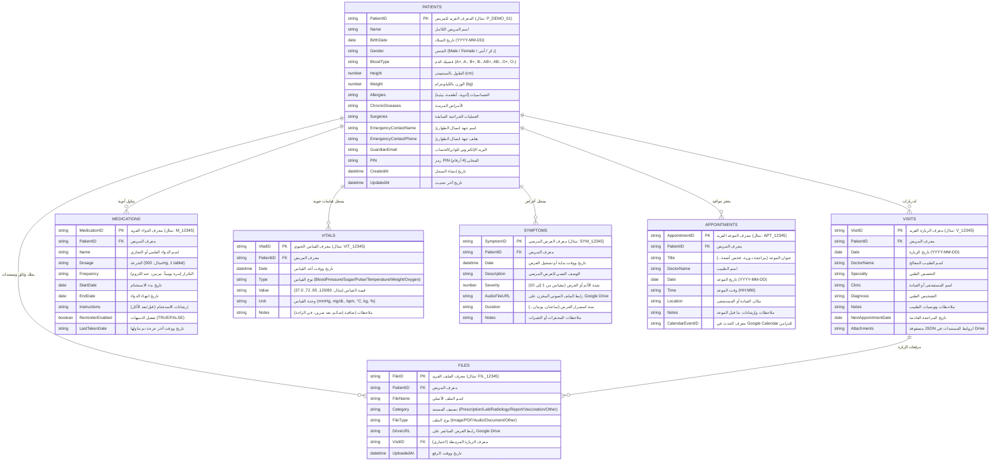

# مخطط قاعدة بيانات تطبيق سِجِل (Sejel Database Schema)

يوثق هذا الملف بنية قاعدة البيانات المركزية لتطبيق "سِجِل" المخزنة في **Google Sheets** كقاعدة بيانات سحابية وتطابقها في **IndexedDB** للعمل بدون اتصال (Offline-First).

---

## 1. مخطط العلاقات (Entity-Relationship Diagram)

---

## 2. تفاصيل التبويبات السبعة (Detailed Tables Specifications)

### 1. جدول المرضى (`Patients`)
يحتوي على البيانات الطبية الأساسية والحساسة لكل مريض ضمن العائلة.

| اسم العمود | النوع | إلزامي؟ | الوصف | أمثلة |
| :--- | :--- | :--- | :--- | :--- |
| `PatientID` | String (PK) | نعم | معرف فريد يبدأ بـ `P_` | `P_DEMO_01` |
| `Name` | String | نعم | الاسم الرباعي أو الثلاثي | أحمد عبد الله المنصوري |
| `BirthDate` | Date | نعم | تاريخ الميلاد بتنسيق ISO | `1990-05-15` |
| `Gender` | String | نعم | `Male` أو `Female` | `Male` |
| `BloodType` | String | لا | فصيلة الدم | `O+`, `A+`, `AB-` |
| `Height` | Number | لا | الطول بوحدة cm | `178` |
| `Weight` | Number | لا | الوزن بوحدة kg | `76.5` |
| `Allergies` | String | لا | قائمة الحساسيات مفصولة بفواصل | بنسلين، مكسرات، لقاح |
| `ChronicDiseases`| String | لا | الأمراض المزمنة | ضغط الدم، السكري نمط 2 |
| `Surgeries` | String | لا | العمليات السابقة مع السنة | استئصال مرارة (2020) |
| `EmergencyContactName` | String | نعم | اسم الشخص للطوارئ | سارة المنصوري |
| `EmergencyContactPhone`| String | نعم | هاتف الطوارئ مع الرمز الدولي | `+966501234567` |
| `GuardianEmail` | String | نعم | بريد حساب Google الرئيسي | `guardian@example.com` |
| `PIN` | String (4) | نعم | رمز الحماية المحلي | `1990` |
| `CreatedAt` | ISO DateTime | نعم | وقت إنشاء السجل | `2026-08-26T08:00:00.000Z` |
| `UpdatedAt` | ISO DateTime | نعم | وقت التحديث | `2026-08-26T08:30:00.000Z` |

---

### 2. جدول الزيارات الطبية (`Visits`)
يوثق الزيارات للعيادات والمستشفيات والتشخيصات.

| اسم العمود | النوع | إلزامي؟ | الوصف | أمثلة |
| :--- | :--- | :--- | :--- | :--- |
| `VisitID` | String (PK) | نعم | معرف الزيارة | `V_1724658000` |
| `PatientID` | String (FK) | نعم | معرف المريض التابع له | `P_DEMO_01` |
| `Date` | Date | نعم | تاريخ الاستشارة الطبية | `2026-08-10` |
| `DoctorName` | String | نعم | اسم الطبيب | د. طارق العمري |
| `Specialty` | String | لا | التخصص الطبي | باطنة، قلب، عيون |
| `Clinic` | String | لا | اسم المستشفى أو المركز | مجمع الملك فهد الطبي |
| `Diagnosis` | String | نعم | التشخيص الطبي للحالة | التهاب جيوب أنفية حاد |
| `Notes` | String | لا | توصيات الطبيب والملاحظات | الإكثار من السوائل وراحة 3 أيام |
| `NextAppointmentDate` | Date | لا | موعد الزيارة القادمة | `2026-08-24` |
| `Attachments` | JSON Array | لا | مصفوفة لمعرفات وروابط الوثائق | `["FIL_01", "FIL_02"]` |

---

### 3. جدول الأدوية (`Medications`)
إدارة جدول العلاج وجرعات الأدوية ومتابعة الالتزام.

| اسم العمود | النوع | إلزامي؟ | الوصف | أمثلة |
| :--- | :--- | :--- | :--- | :--- |
| `MedicationID` | String (PK) | نعم | معرف الدواء | `M_1724658111` |
| `PatientID` | String (FK) | نعم | معرف المريض | `P_DEMO_01` |
| `Name` | String | نعم | الاسم التجاري/العلمي للدواء | أوجمنتين (Augmentin) |
| `Dosage` | String | نعم | حجم الجرعة | 1000mg / حبة واحدة |
| `Frequency` | String | نعم | تكرار أخذ الدواء | كل 12 ساعة بعد الأكل |
| `StartDate` | Date | نعم | تاريخ بداية الجرعات | `2026-08-10` |
| `EndDate` | Date | لا | تاريخ الانتهاء المتوقع | `2026-08-17` |
| `Instructions` | String | لا | إرشادات الاستخدام | يؤخذ مع وجبة الطعام لتجنب ألم المعدة |
| `ReminderEnabled` | Boolean | نعم | تفعيل التنبيه في المواعيد | `TRUE` / `FALSE` |
| `LastTakenDate` | ISO DateTime | لا | وقت آخر جرعة تم تسجيلها | `2026-08-26T07:00:00.000Z` |

---

### 4. جدول القياسات الحيوية (`Vitals`)
سجل المؤشرات الحيوية اليومية أو الدورية.

| اسم العمود | النوع | إلزامي؟ | الوصف | أنواع القياس والوحدات |
| :--- | :--- | :--- | :--- | :--- |
| `VitalID` | String (PK) | نعم | معرف القياس | `VIT_1724658222` |
| `PatientID` | String (FK) | نعم | معرف المريض | `P_DEMO_01` |
| `Date` | ISO DateTime | نعم | تاريخ ووقت القياس | `2026-08-26T07:30:00.000Z` |
| `Type` | Enum | نعم | نوع القياس الحيوي | `BloodPressure`, `Sugar`, `Pulse`, `Temperature`, `Weight`, `Oxygen` |
| `Value` | String | نعم | القيمة المسجلة | `120/80` (ضغط) أو `95` (سكر) |
| `Unit` | String | نعم | وحدة القياس | `mmHg`, `mg/dL`, `bpm`, `°C`, `kg`, `%` |
| `Notes` | String | لا | سياق القياس | صائم 8 ساعات، بعد مجهود بدني |

---

### 5. جدول الأعراض والتسجيل الصوتي (`Symptoms`)
متابعة الأعراض المسجلة صوتيًا أو كتابيًا مع درجة الألم.

| اسم العمود | النوع | إلزامي؟ | الوصف | أمثلة |
| :--- | :--- | :--- | :--- | :--- |
| `SymptomID` | String (PK) | نعم | معرف العرض | `SYM_1724658333` |
| `PatientID` | String (FK) | نعم | معرف المريض | `P_DEMO_01` |
| `Date` | ISO DateTime | نعم | تاريخ وتوقيت ظهور العرض | `2026-08-25T21:00:00.000Z` |
| `Description` | String | نعم | التفريغ الصوتي أو الوصف المكتوب | ألم خفيف في أسفل الظهر يمتد للساق |
| `Severity` | Number (1-10)| نعم | مقياس شدة الألم | `6` (من 1 إلى 10) |
| `AudioFileURL` | String | لا | رابط التسجيل الصوتي في Drive | `https://drive.google.com/...` |
| `Duration` | String | لا | مدة استمرار العرض | 4 ساعات متواصلة |
| `Notes` | String | لا | أسباب محتملة أو أدوية تم تناولها | ظهر بعد حمل أوزان ثقيلة |

---

### 6. جدول المواعيد والتكامل مع التقويم (`Appointments`)
إدارة المواعيد الطبية والربط بـ Google Calendar.

| اسم العمود | النوع | إلزامي؟ | الوصف | أمثلة |
| :--- | :--- | :--- | :--- | :--- |
| `AppointmentID` | String (PK) | نعم | معرف الموعد | `APT_1724658444` |
| `PatientID` | String (FK) | نعم | معرف المريض | `P_DEMO_01` |
| `Title` | String | نعم | عنوان الموعد أو الغرض | فحص دوري للأسنان وتنظيف |
| `DoctorName` | String | لا | اسم الطبيب | د. منى زاهر |
| `Date` | Date | نعم | تاريخ الموعد | `2026-09-02` |
| `Time` | Time (HH:MM) | نعم | وقت الحضور | `16:30` |
| `Location` | String | لا | العيادة أو المستشفى | عيادات المسواك - فرع العليا |
| `Notes` | String | لا | تعليمات التحضير | إحضار صور الأشعة السابقة |
| `CalendarEventID`| String | لا | معرّف الحدث في تقويم Google | `abc123eventid@google.com` |

---

### 7. جدول المستندات الطبية والملفات (`Files`)
أرشيف كامل لكافة التقارير، الروشتات، التحاليل، وصور الأشعة.

| اسم العمود | النوع | إلزامي؟ | الوصف | أمثلة |
| :--- | :--- | :--- | :--- | :--- |
| `FileID` | String (PK) | نعم | معرف الملف | `FIL_1724658555` |
| `PatientID` | String (FK) | نعم | معرف المريض | `P_DEMO_01` |
| `FileName` | String | نعم | اسم الملف | `تحليل_دم_شامل_CBC.pdf` |
| `Category` | Enum | نعم | تصنيف المستند | `Prescription`, `Lab`, `Radiology`, `Report`, `Vaccination`, `Other` |
| `FileType` | Enum | نعم | نوع الملف التقني | `PDF`, `Image`, `Audio`, `Document`, `Other` |
| `DriveURL` | String | نعم | رابط المعاينة والتحميل من Google Drive | `https://drive.google.com/file/d/...` |
| `VisitID` | String (FK) | لا | معرف الزيارة المرتبطة | `V_1724658000` |
| `UploadedAt` | ISO DateTime | نعم | تاريخ وتوقيت الرفع | `2026-08-26T08:15:00.000Z` |

---

## 3. استراتيجية المزامنة غير المتصلة (Offline Sync Mapping)
- يتم تخزين كل جدول من الجداول السبعة محلياً في **IndexedDB** بنفس هيكل الأعمدة مع إضافة خاصية `_syncStatus` بحالات:
  - `synced`: متزامن بالكامل مع Google Sheets.
  - `pending_create`: تم إنشاؤه بدون إنترنت وينتظر الإرسال.
  - `pending_update`: تم تعديله بدون إنترنت وينتظر التحديث.
  - `pending_delete`: تم حذفه بدون إنترنت وينتظر الحذف من Google Sheets.
- عند استعادة الاتصال بالإنترنت، يرسل `syncEngine` طلب `batchSync` إلى Google Apps Script Web App، والذي ينفذ التغييرات دفعة واحدة ويعيد تأكيد السجلات.
